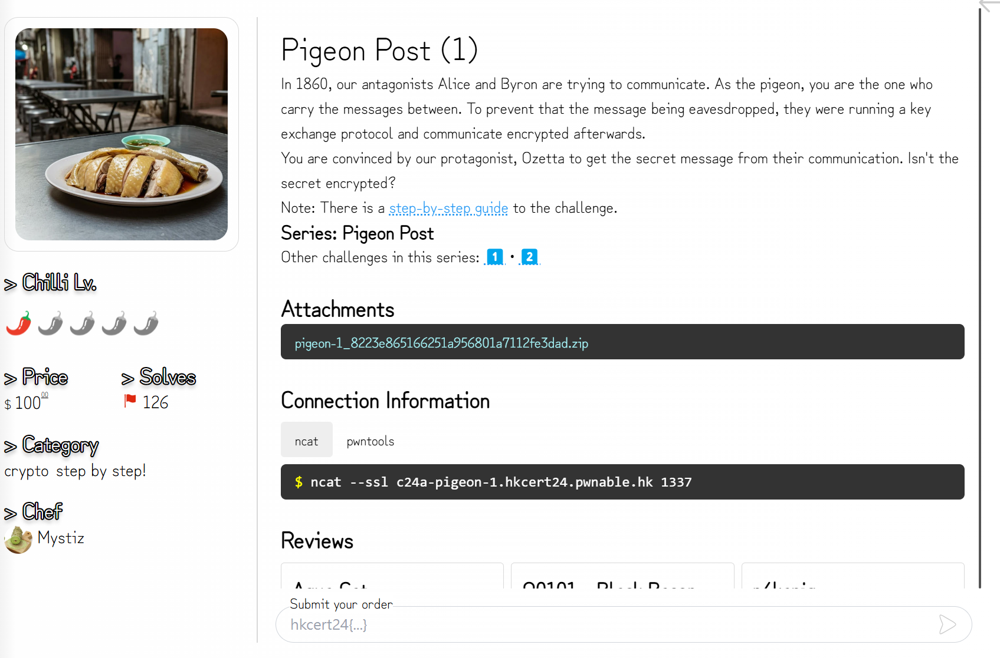
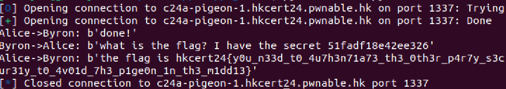

# crypto - Pigeon Post (1) Writeup

  

---  



  

## FLAG：
`hkcert24{y0u_n33d_t0_4u7h3n71a73_th3_0th3r_p4r7y_s3cur31y_t0_4v01d_7h3_p1ge0n_1n_th3_m1dd13}`

## 觀察：
- chall.py 作為Alice與Byron，我們是man in the middle攻擊者。

## 思路：
- 分別跟Alice與Byron建立一組key。

  
## 目標：
- 向Alice傳送Byron的secret，即可獲得FLAG。

  
## 步驟：
1. 從Alice收到的訊息，先用自己與Alice共用的session key解密察看內容，再用自己與Byron共用的session key加密，傳給Byron，反之亦然。

## Exploit：  

```python
from Crypto.Cipher import AES
from pwn import *
import json
import os
  
# interact with users
  
def receive(r):
    res = r.recvline().decode().strip()
    return json.loads(res)
  
def send(r, target, req):
    j = json.dumps(req, separators=(',', ':'))
    r.sendlineafter(f'🕊️'.encode(), f'{target} {j}'.encode())
  
# cryptographic toolbox
  
P = 0xffffffffffffffffc90fdaa22168c234c4c6628b80dc1cd129024e088a67cc74020bbea63b139b22514a08798e3404ddef9519b3cd3a431b302b0a6df25f14374fe1356d6d51c245e485b576625e7ec6f44c42e9a637ed6b0bff5cb6f406b7edee386bfb5a899fa5ae9f24117c4b1fe649286651ece45b3dc2007cb8a163bf0598da48361c55d39a69163fa8fd24cf5f83655d23dca3ad961c62f356208552bb9ed529077096966d670c354e4abc9804f1746c08ca18217c32905e462e36ce3be39e772c180e86039b2783a2ec07a28fb5c55df06f4c52c9de2bcbf6955817183995497cea956ae515d2261898fa051015728e5a8aacaa68ffffffffffffffff
G = 0x2
  
def derive_public_key(private_key: int):
    return pow(G, private_key, P)
  
def derive_session_key(other_public_key: int, self_private_key: int):
    shared_key = pow(other_public_key, self_private_key, P)
    session_key = hashlib.sha256(shared_key.to_bytes(512, 'big')).digest()
    return session_key
def encrypt(session_key: bytes, message: bytes) -> str:
    nonce = os.urandom(8)
    cipher = AES.new(session_key, AES.MODE_CTR, nonce=nonce)
    ciphertext = nonce + cipher.encrypt(message)
    return ciphertext.hex()
  
def decrypt(session_key: bytes, ciphertext: str) -> bytes:
    ciphertext = bytes.fromhex(ciphertext)
    nonce, ciphertext = ciphertext[:8], ciphertext[8:]
    cipher = AES.new(session_key, AES.MODE_CTR, nonce=nonce)
    return cipher.decrypt(ciphertext)
  
 
# ===
  
def connect():
    return remote("c24a-pigeon-1.hkcert24.pwnable.hk", 1337, ssl=True)
  
def experiment1():
    r = connect()
  
    # Alice runs `init_handshake`
    j = receive(r)
    print(f'Alice->Byron: {j}')
  
    send(r, 'byron', j)
  
    # Byron runs `receive_handshake`
    j = receive(r)
    print(f'Byron->Alice: {j}')
  
    send(r, 'alice', j)
  
    # Alice runs `finish_handshake`
    j = receive(r)
    print(f'Alice->Byron: {j}')
  
    send(r, 'byron', j)

 
    # Byron receives the message "done!"
    j = receive(r)
    print(f'Byron->Alice: {j}')
  
    send(r, 'alice', j)
  
    # Alice receives the message "what is the flag?"
    j = receive(r)
    print(f'Alice->Byron: {j}')
  
    send(r, 'byron', j)
  
    # Byron receives the message "the flag is..."
    j = receive(r)
    print(f'Byron->Alice: {j}')
  
    send(r, 'alice', j)
  
    # Alice receives the message "nice flag!"
    j = receive(r)
    print(f'Alice->Byron: {j}')
  
    send(r, 'byron', j)
  
    # Byron receives the message ":)"
  
def experiment2():
    r = connect()
    pigeon_private_key = 1337
  
    # Alice runs `init_handshake`
    j = receive(r)
  
    # 😈 Before we are sending the message to Byron, we will replace Alice's public key to our own public key
    alice_public_key = j['public_key']
    pigeon_public_key = derive_public_key(pigeon_private_key)
    j['public_key'] = pigeon_public_key
    send(r, 'byron', j)
  
    # Byron runs `receive_handshake`
    j = receive(r)
  
    # 😈 TODO: Before we are sending the message back to Alice, we will replace Byron's public key...
    byron_public_key = j['public_key']
    j['public_key'] = pigeon_public_key
    send(r, 'alice', j)
    # Alice runs `finish_handshake`
    j = receive(r)
  
    # 😈 We need to fix the ciphertext before sending to Byron
    alice_session_key = derive_session_key(alice_public_key, pigeon_private_key)
    m = decrypt(alice_session_key, j['ciphertext'])
    print(f'Alice->Byron: {m}')
    assert m == b'done!', "Did you replace Byron's key with ours?"
    # 😈 TODO: derive the session key between us and Byron, too!
    byron_session_key = derive_session_key(byron_public_key, pigeon_private_key)
    j['ciphertext'] = encrypt(byron_session_key, m)
    send(r, 'byron', j)
  
    # Byron receives the message "done!"
    j = receive(r)
    m = decrypt(byron_session_key, j['ciphertext'])
    print(f'Byron->Alice: {m}')
    j['ciphertext'] = encrypt(alice_session_key, m)
    send(r, 'alice', j)
 
    # 😈 TODO: continue the communication to get the flag!
    j = receive(r)
    m = decrypt(alice_session_key, j['ciphertext'])
    print(f'Alice->Byron: {m}')
  
if __name__ == '__main__':
    # experiment1()
    experiment2()
```

  

