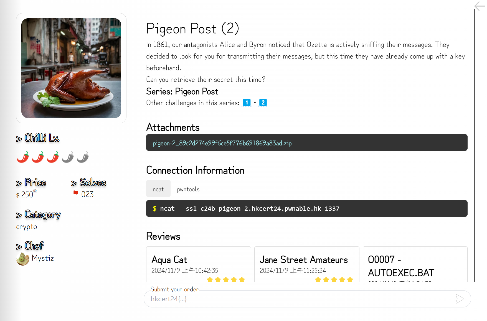
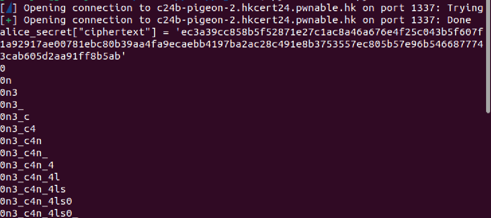
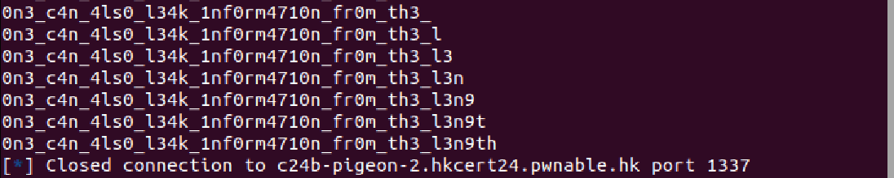

# crypto - Pigeon Post (2) Writeup

---  


## FLAG：
`hkcert24{0n3_c4n_4ls0_l34k_1nf0rm4710n_fr0m_th3_l3n9th}`

## 觀察：
- 題目利用AES CTR mode加密，特性是`len(ciphertext) = 8 + len(plaintext)`，且對ciphertext的某個特定byte做xor時，解密後的plaintext也會被執行同樣的xor運算。

## 思路：
- Byron檢查FLAG格式後傳資料給Alice，在Alice回覆的ciphertext中可以由長度判斷其內容為`:)`還是`what happened?`，可以嘗試發送不同的FLAG讓Alice給出回復，類似Padding Oracle Attack。
- Byron檢查FLAG時是使用`re.match(br'hkcert24{.*}', flag)`來判斷，當我們嘗試將FLAG`.*`中的某個byte `f`與隨機的byte `b`進行xor，並通過檢查時，表示 `b^f = '}'`，可得知`f = '}'^b`。

## 目標：
- 根據Alice的回覆，暴力破解FLAG的每個byte。

## 步驟：
1. 從Alice的回覆中取出FLAG的密文flag。
2. 對flag的第一個byte翻轉，直到通過Byron的檢查(由Alice的回覆判斷)，計算出`f`。
   - FLAG尾端的`}`必須變更使他不會解密回`}`，否則一定通過Byron的檢查。
3. 逐步找出flag的所有byte。

## Exploit：  

```python
from Crypto.Cipher import AES
from Crypto.Util.number import *
from pwn import *
import json
import os
  
# interact with users
  
def receive(r):
res = r.recvline().decode().strip()
return json.loads(res)
  
def send(r, target, req):
j = json.dumps(req, separators=(',', ':'))
r.sendlineafter(f'🕊️'.encode(), f'{target} {j}'.encode())
 
def connect():
	return remote("c24b-pigeon-2.hkcert24.pwnable.hk", 1337, ssl=True)
  
 
def experiment2():
	FLAG = ""
	r = connect()
	  
	j = receive(r) # alice_public_key = j['public_key']
	j = receive(r) # byron_public_key = j['public_key']
	j = receive(r) # cipher_done = j['ciphertext']
	  
	send(r, "byron", j)
	byron_secret = receive(r)
	send(r, 'alice', byron_secret)
	alice_secret = receive(r)
	print(f'{alice_secret["ciphertext"] = }')
	#print(f'{bytes.fromhex(alice_secret) = }')
	  
	prefix, flag, postfix = (alice_secret["ciphertext"][:29*2],
	alice_secret["ciphertext"][29*2:-1*2],
	alice_secret["ciphertext"][-1*2:])
	flag_sz = len(flag) >> 1
	new_postfix = '00' if postfix == 'ff' else 'ff'
	  
	for i in range(flag_sz) :
		for b in range(0x100) :
			guess = hex(int(flag[i*2:i*2+2], 16) ^ b)[2:].zfill(2)
			new_flag = flag[:i*2] + guess + flag[i*2+2:]
			# print(new_flag)
			new_payload = prefix + new_flag + new_postfix
			j['ciphertext'] = new_payload
			send(r, 'byron', j)
			byron_resp = receive(r)
			send(r, 'alice', byron_resp)
			alice_resp = receive(r)
			if len(alice_resp['ciphertext']) == 20: # :)
				FLAG += chr(b^ord('}'))
				print(FLAG)
				break
  
 
if __name__ == '__main__':
	experiment2()
```


